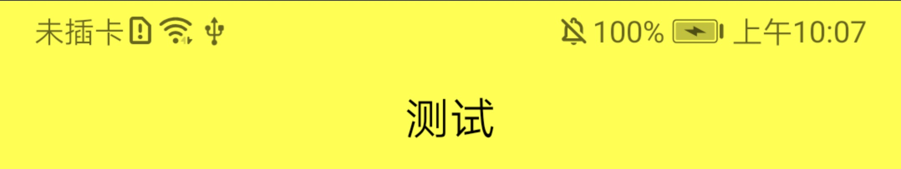
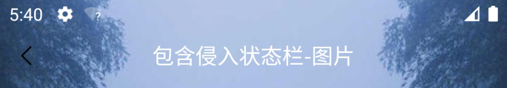

# YTitleBar

## 功能
- 左, 中, 右
- 默认右不加载
- 左, 中, 右都可以通过属性引用外部 layout 来替换
- 左, 中, 右都可以通过给内部的 View 分配指定的 ID 来替换

自定义顶部导航栏，背景色可侵入状态栏

| 属性 | 描述 |
|:---|:---|
| app:tbar_bg | 背景色，侵入状态栏，状态栏图标和字体的颜色会根据背景色调整为白色或则黑色 |
| app:tbar_left | 引用 layout 作为左侧的 View，默认为返回箭头 |
| app:tbar_center | 引用 layout 作为中间的 View，默认为 TextView |
| app:tbar_right | 引用 layout 作为右侧的 View，默认为 TextView |
| app:tbar_leftShow | View 是否显示，默认显示 |
| app:tbar_centerShow | View 是否显示，默认显示 |
| app:tbar_rightShow | 是否显示，默认不显示 |
| app:tbar_leftColor | 左侧返回箭头颜色 |
| app:tbar_centerColor | 字体颜色 |
| app:tbar_centerSize | 字体大小 |
| app:tbar_rightColor | 字体颜色 |
| app:tbar_rightSize | 字体大小 |
| app:tbar_centerStr | 文案 |
| app:tbar_rightStr | 文案 |